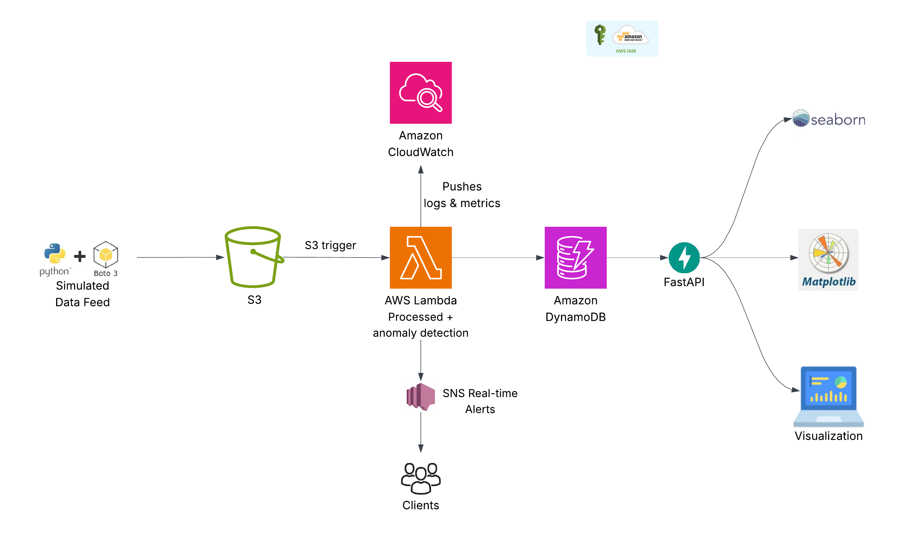

# Renewable Energy Data Pipeline Using AWS Services

This project demonstrates a real-time energy data pipeline using AWS services like S3, Lambda, DynamoDB, CloudWatch and SNS, along with FastAPI and Python for API access and visualization.

---

## Project Overview

The goal of this pipeline is to ingest simulated energy data from multiple sites, process and store it in DynamoDB in a scalable manner, detect anomalies, trigger real-time alerts, and visualize trends through dashboards.

**The project leverages the following tools and services:**

- **Python**: Simulated live data feed 
- **Amazon S3**:File storage & event triggers
- **AWS Lambda**: Real-time processing
- **DynamoDB**: Processed data storage
- **FastAPI**: API access
- **Amazon SNS**: Anomaly detection & alerts
- **Seaborn/Matplotlib**: Data visualization 
- **Amazon CloudWatch**: Logging and monitoring

---

## Architecture


---

## 🔧 Setup Instructions

### 🛠️ Prerequisites

* AWS Account (with admin or necessary permissions)
* AWS CLI configured
* Python 3.8 or later
* `virtualenv` installed

### 📁 Local Environment Setup

```bash
# Clone the repository
git clone https://github.com/RajeshShahu1/renewable-energy-data-pipeline.git
cd renewable-energy-data-pipeline

# Create and activate virtual environment
python -m venv venv
source venv/bin/activate  # or venv\Scripts\activate on Windows

# Install dependencies
pip install -r requirements.txt
```

### ☁️ AWS Resource Setup

* **S3 Bucket** ('renewable-energy-data1') for simulated data uploads
* **DynamoDB Table** (`energy_data`)

  * Partition key: `site_id`
  * Sort key: `timestamp`
* **SNS Topic** (`energy-anomaly-alerts`) with email subscription
* **IAM Role** with permissions: S3, DynamoDB, SNS, Lambda, CloudWatch
* **CloudWatch Logs** (automatically integrated with Lambda)

---

## How to Run Components

### Simulated Data Feed

Continuously uploads JSON files with energy data to S3.

```bash
python main.py
```

### Lambda Function

Triggered on every S3 upload. Performs:

* Parsing and validation
* Anomaly detection 
* Storing processed records in DynamoDB
* Sending alert via SNS (if anomaly found)

### Run FastAPI Backend

```bash
uvicorn dynamodb_api_fastapi:app --reload
```

Access docs:

```
http://localhost:8000/docs
```

---

## 📊 How to Visualize Data

Run the visualization script:

```bash
python visualize.py
```

Generates the following charts:

* Energy Generated vs Consumed (line chart)
* Net Energy Distribution (box plot)
* Anomaly Rate (%) per site
* Total kWh per site (stacked bar)
* Anomalies per site (bar)
* Timeline of anomalies (scatter)

All graphs are saved in the `/outputs` directory.

---

## 🌐 How to Use the API

### `/records`

Fetch records by site and optional time range.

```
GET /records?site_id=SolarFarm_AZ_001&start_time=2025-06-06T00:00:00&end_time=2025-06-06T23:59:59
```

### `/anomalies`

Fetch anomalies for a specific site.

```
GET /anomalies?site_id=BatteryBank_TX_005
```

## 🛠️ Design Decisions

* **S3 → Lambda → DynamoDB**: Serverless and scalable data ingestion pattern.
* **SNS for alerts**: Enables real-time anomaly notification (email/SMS).
* **FastAPI**: Lightweight, fast API framework with built-in Swagger UI.
* **CloudWatch**: Logs every Lambda execution and captures errors.
* **DynamoDB**: Low-latency NoSQL storage for high-throughput access.
* **Seaborn/Matplotlib**: Easy and polished static chart generation.

---

## 📂 Folder Structure

```
energy-data-pipeline/
│
├── simulate_feed.py              # S3 uploader for simulated data
├── lambda_function.py            # AWS Lambda processing logic
├── dynamodb_api_fastapi.py       # FastAPI app for data querying & alerts
├── visualize.py                  # Visualization script
├── requirements.txt
├── README.md
└── outputs/                      # Saved PNG charts
```

---


## 📽️ Demo Video (to be added)

📎 Link to your video demonstration of the project
🧾 Walkthrough of key features, decisions, and usage instructions

---

## 📬 Contact

Created by **\[Your Name]**
📧 Email: [your.email@example.com](mailto:your.email@example.com)
🔗 [LinkedIn](https://linkedin.com/in/your-profile)

---


